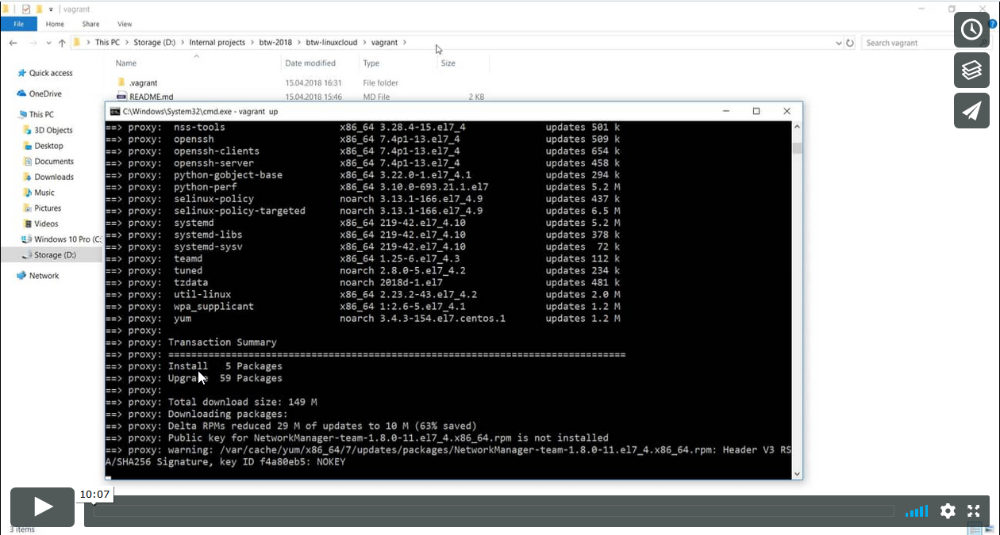

: [Acasa](./index.html) / [Mediul de lucru](./mediu_lucru.html)

# Cum pornim masinile virtuale si configuram mediul de lucru

Pentru a va usura munca am creat o metoda automata de a porni si configura mediul de lucru ce va fi folosit pentru workshop. La finalul paginii aveti si o demonstratie video.

1. Descarcam si instalam Virtual Box de [aici](https://download.virtualbox.org/virtualbox/5.2.8/VirtualBox-5.2.8-121009-Win.exe)

2. Descarcam si instalam Vagrant de [aici](https://releases.hashicorp.com/vagrant/2.0.3/vagrant_2.0.3_x86_64.msi)

3. Cream un folder nou, dedicat, numit `Vagrant`. In acest folder cream fisierul denumit Vagrantfile (continutul fisierului il gasiti [aici](https://raw.githubusercontent.com/aso930/btw-linuxcloud/master/vagrant/Vagrantfile)). Aveti mare grija sa nu existe spatii in path-ul spre fisier. Spre exemplu `D:\Downloads\Vagrant\Vagrantfile` e un path valid, dar `D:\My Documents\Vagrant\Vagrantfile` nu este. Daca salvati fisierul, asigurati-va sa nu aiba extensie, `Vagrantfile.txt` nu e valid.

4. Deschidem Command Prompt in folderul unde am descarcat fisierul Vagrantfile. Apasam pe bara de adrese in File explorer, scriem `cmd` si apasam tasta `Enter`.

5. Ne asiguram ca suntem in folderul unde e fisierul Vagrantfile. Scriem `dir` in fereastra Command Prompt, ar trebui sa vedem fisierul Vagrantfile. Daca nu apare, verificati ca sunteti in folderul care trebuie.

6. Executam comanda `vagrant up`

7. Lasam comanda sa ruleze. Aceasta va dura cateva minute, in functie de viteza conexiunii la internet. La final va aparea ca s-a executat cu succes.

8. Oprim masinile virtuale folosind `vagrant halt` si inchideti fereastra

* * *

This work is licensed under a [Creative Commons Attribution-NonCommercial-ShareAlike 4.0 International License](http://creativecommons.org/licenses/by-nc-sa/4.0/)