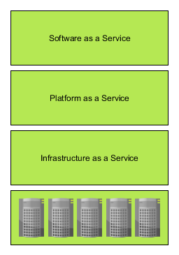
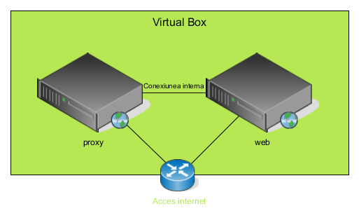

: [Acasa](../index.html) / [Arhitectura cloud](./arhitectura_cloud.html)

# Arhitectura cloud

Exista multe sub-domenii in cloud computing: SaaS, Paas, Iaas. Fiecare cu avantaje si dezavantaje. Daca privim organizarea unui sistem ca fiind un set de straturi ierarhice, diferitele domenii ar arata cam asa:

 - IaaS - Infrastructure as a Service este un tip de serviciu care ofera clientilor un API care abstractizeaza resursele fizice, oferindu-le posibilitatea sa isi creeze masini virtuale, retele private, stocare la cerere. Acest tip de cloud ofera cea mai mare libertate clientilor, acestia pot pune in picioare orice fel de infrastructura fara restrictii.
 - PaaS - Platform as a Service se afla un strat mai sus fata de IaaS, si ofera clientilor platforme (servere de aplicatii), pe care acestia pot lansa aplicatiile lor. Acest tip de platforma este preferat in special daca nu vrei sa te ocupi de administrarea sistemelor, a retelelor sau a securitatii sistemului de operare. Un client poate alege intre diferite platforme de aplicatii si urca codul sau care va deveni astfel disponibil.
  - SaaS - Software as a Service ofera clientilor acces la diferite programe fara ca acestia sa fie nevoiti sa instaleze diverse componente sau sa le administreze. Exemple populare sunt Google Docs sau Office Online.

In acest curs in schimb noi ne vom concentra pe arhitectura unei aplicatii simple, in contextul unui cloud de tip Platform as a Service.

Serviciul pe care il vom pune in picioare arata in felul urmator: 

Acesta contine un web proxy si o aplicatie web. Ele ruland pe doua masini virtuale, cu CentOS Linux preinstalat.

Componente ale unui sistem de tip cloud, sau diverse roluri pe care ar putea un server sa le indeplineasca:

- proxy - un server care are rol de a intermediea actiunile primite de la utilizator, astfel incat aceasta sa fie trimise catre serverele necesare; acest rol ne ajuta sa "ascundem" sau sa validam interactiunile utilizatorilor, inainte de a fi trimite catre servere necesare; Rezultatele trimise catre utilizatori, sunt primite de catre proxy de la serverele din spatele sau, si vor aparea ca si cum au fost trimise de catre proxy; astfel utilizatorii nu sunt constienti ce servere sunt in spatele proxyului; de obicei, acest tip de server ne ajuta si ca web server;
- load balancer - acest rol se ocupa de distribuirea volumului de lucru intre mai multe unitati de procesare. scopul balansarii este de a optimiza resursele disponibile, de a folosi in paralel mai multe resurse, de a micsora timpul de raspuns pentru un volum de munca mai mare si de a evita situatia in care un singur punct de lucru este suprasolicitat, in timp ce altele sunt libere sa primeasca cereri de procesare;
- web server - un server care asculta pentru cereri de la utilizatori (de obicei HTTP sau HTTPS) si raspunde cu informatiile cerute;
- application cluster - se refera la o grupare de resurse, care servesc acelasi rol; aceste noduri de procesare sunt grupate pentru a distribui volumul de munca intre ele; acesta tip de grupare ne va da posibilitatea sa crestem capacitatile de procesare fie prin scalare verticala (adaugare de resurse harware pe nodurile existente - CPU, memorie) sau scalare orizontala (adaugare de noduri noi de procesare, similare cu nodurile curente); de asemenea, atunci cand un nod nu mai este disponibil, din motive neasteptate, alt nod poate suplini astfel incat capacitatile de procesare ale Clusterului sa nu fie intrerupte;
- database - colectie organizata de date, servite de o aplicatie care stie sa administreze cererile de citire sau modificare ale datelor; 

#### [Linia de comanda](./linia_comanda.html)

* * *

This work is licensed under a [Creative Commons Attribution-NonCommercial-ShareAlike 4.0 International License](http://creativecommons.org/licenses/by-nc-sa/4.0/)