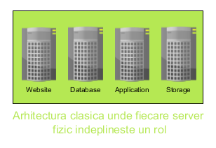

: [Acasa](../index.html) / [Masini virtuale](./masini_virtuale.html)

# Masini virtuale

Ca utilizatori normali de produse software noi suntem obisnuiti sa avem un calculator sau un laptop (care ruleaza Windows, distributii Linux sau MacOS) pe care facem operatiunile noastre de zi cu zi. 

Acest lucru este valabil intr-o anumita masura si in mediul enterprise. Avem modele diferite de calculatoare speciale, numite servere, pe care sunt rulate diferite aplicatii enterprise.

Intre timp, nevoia de a rula foarte multe aplicatii dar si evolutia componentelor si a tehnologiilor software, au condus la posibilitatea de a creea servere virtuale (numite masini virtuale).

O masina virtuala este  un server care ruleaza intr-un server (numit host, in literatura de specialitate). Acest lucru este facut posibil de software, denumit hypervisor, care permite configurarea si pornirea unor astfel de masini. 

Printre avantajele unei arhitecturi bazate pe masini virtuale se enumera: posibilitatea de comasa mai multe servere fizice cu roluri diferite intr-un singur server fizic pe care ruleaza mai multe masini virtuale, izolarea aplicatiilor in masini virtuale separate din motive de performanta sau securitate, usurinta de administrare.

Diferenta dintre servere fizice si masini virtuale:

[TO DO](image)

#### [Conceptul de cloud computing](./cloud_computing.html)

* * *

This work is licensed under a [Creative Commons Attribution-NonCommercial-ShareAlike 4.0 International License](http://creativecommons.org/licenses/by-nc-sa/4.0/)